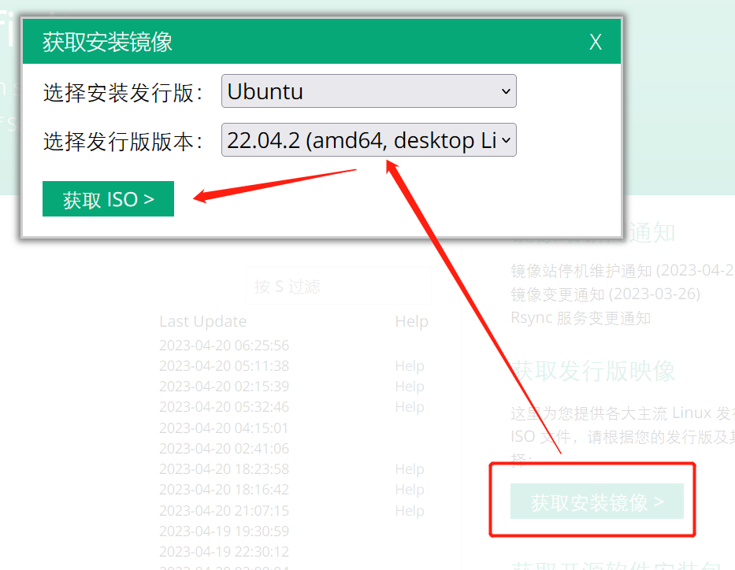
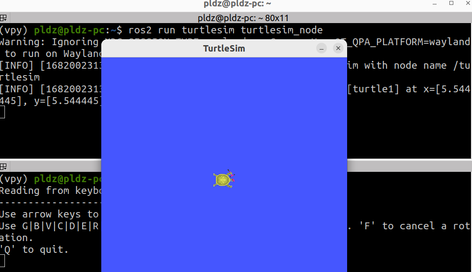

# 1.1 Ubuntu配置与ROS2安装

## 1.1.1 Ubuntu22.04安装

1. 下载Ubuntu22.04：本文选择 [中科大镜像网](https://mirrors.ustc.edu.cn/) ，选择Ubuntu22.04镜像下载，后续放入VMware进行 **断网安装** 



> VMware15链接： 
> 链接：https://pan.baidu.com/s/1BbaGtDhjVXCWeS2vuk3bRw
> 提取码：7lzk 复制这段内容后打开百度网盘手机App，操作更方便哦

2. Ubuntu22.04 换源：将桌面版本的Ubuntu的软件更新设置来源为国内的镜像，或者直接输入命令`sudo gedit /etc/apt/sources.list`将内容改为如下所示：

```shell
deb https://mirrors.ustc.edu.cn/ubuntu/ jammy main restricted universe multiverse
deb-src https://mirrors.ustc.edu.cn/ubuntu/ jammy main restricted universe multiverse
deb https://mirrors.ustc.edu.cn/ubuntu/ jammy-updates main restricted universe multiverse
deb-src https://mirrors.ustc.edu.cn/ubuntu/ jammy-updates main restricted universe multiverse
deb https://mirrors.ustc.edu.cn/ubuntu/ jammy-backports main restricted universe multiverse
deb-src https://mirrors.ustc.edu.cn/ubuntu/ jammy-backports main restricted universe multiverse
deb https://mirrors.ustc.edu.cn/ubuntu/ jammy-security main restricted universe multiverse
deb-src https://mirrors.ustc.edu.cn/ubuntu/ jammy-security main restricted universe multiverse
deb https://mirrors.ustc.edu.cn/ubuntu/ jammy-proposed main restricted universe multiverse
deb-src https://mirrors.ustc.edu.cn/ubuntu/ jammy-proposed main restricted universe multiverse
```


## 1.1.2 下载安装ROS2

1. 输入命令`sudo apt-get update -y`对软件源进行更新，输入`sudo apt-get upgrade -y`对软件进行更新：

```shell
sudo apt-get update -y && sudo apt-get upgrade -y
```

2. 获取ROS2的秘钥，并ROS2的存储库添加到源列表：

```shell
sudo apt install curl gnupg lsb-release && sudo curl -sSL https://raw.githubusercontent.com/ros/rosdistro/master/ros.key -o /usr/share/keyrings/ros-archive-keyring.gpg

echo "deb [arch=$(dpkg --print-architecture) signed-by=/usr/share/keyrings/ros-archive-keyring.gpg] http://packages.ros.org/ros2/ubuntu $(source /etc/os-release && echo $UBUNTU_CODENAME) main" | sudo tee /etc/apt/sources.list.d/ros2.list > /dev/null
```

3. 如果出现关于 `raw.githubusercontent.com` 连接失败的处理

- 1. 访问 `https://tool.lu/ip/` 并输入域名 `raw.githubusercontent.com`，查询 ip 地址，这里查询到的是 `185.199.108.133`


- 2. 修改 `sudo gedit /etc/hosts`文件,并手动添加DNS解析：


4. 下载ROS2-humble：更新软件到最新版本，然后下载ROS2-humble：

```shell
sudo apt-get update -y && sudo apt-get upgrade -y

sudo apt install ros-humble-desktop
```

5. 安装colcon构建工具： 不同于之前ROS1的catkin工具，ROS2用colcon进行包的构建：`sudo apt install python3-colcon-common-extensions`


## 1.1.3 配置ROS2环境并测试

1. 配置ROS2环境： 默认ROS2-humble安装在`/opt/ros/humble/`下，将ROS2的环境添加到用户环境文件`~/.bashrc`中，输入`echo "source /opt/ros/humble/setup.bash" >> ~/.bashrc`

2. 测试ROS2：`ros2 run turtlesim turtlesim_node`和`ros2 run turtlesim turtle_teleop_key`运行小乌龟




## 1.2 ROS2的发展

### 1.2.1 ROS2组成体系

