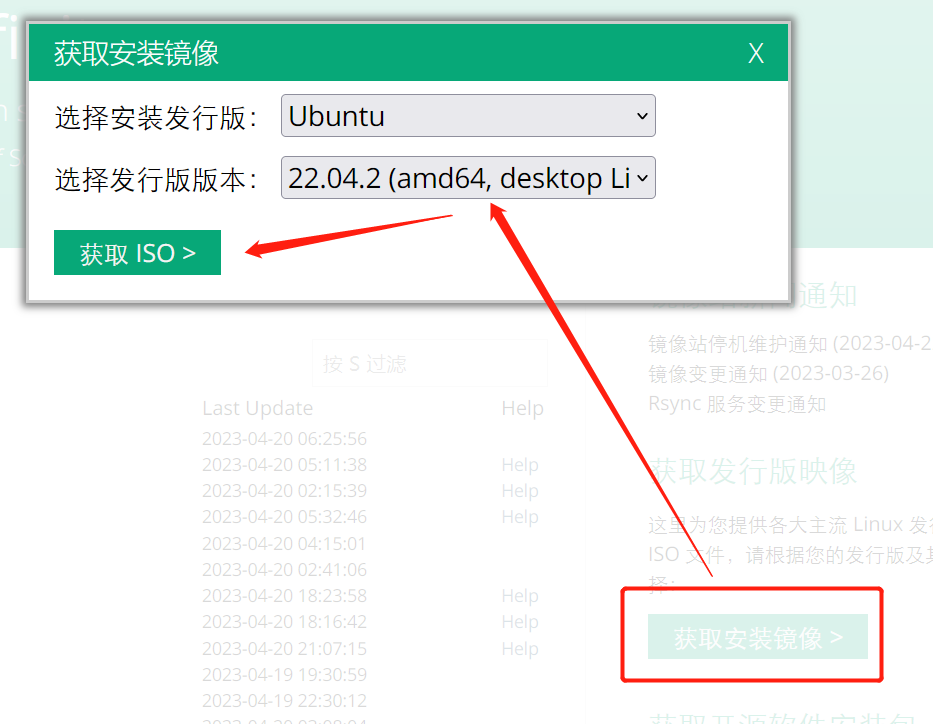
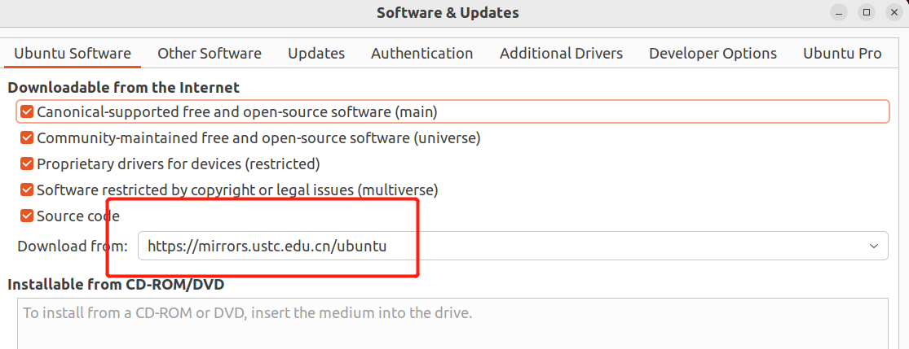
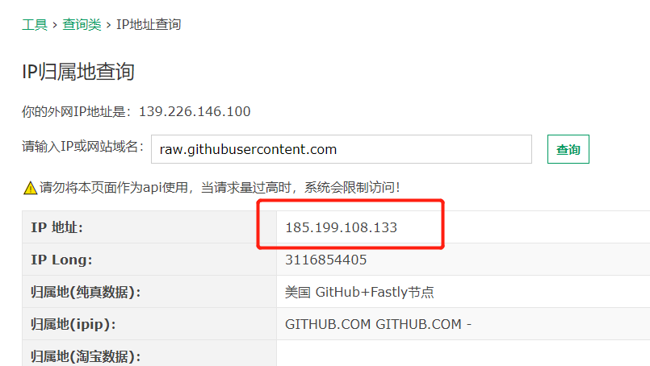
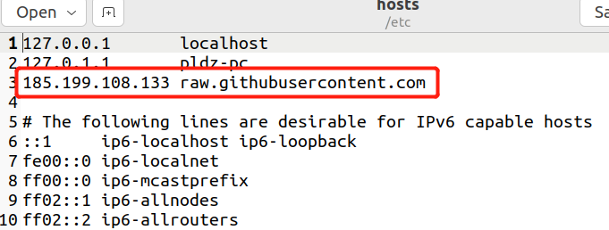
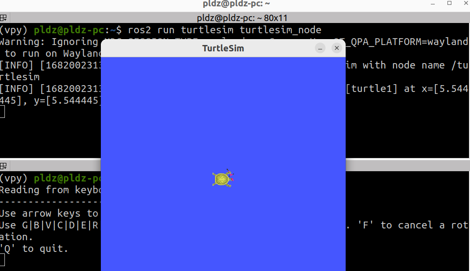
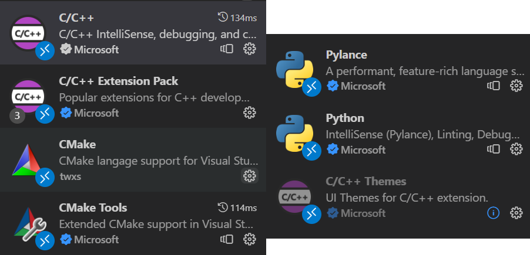
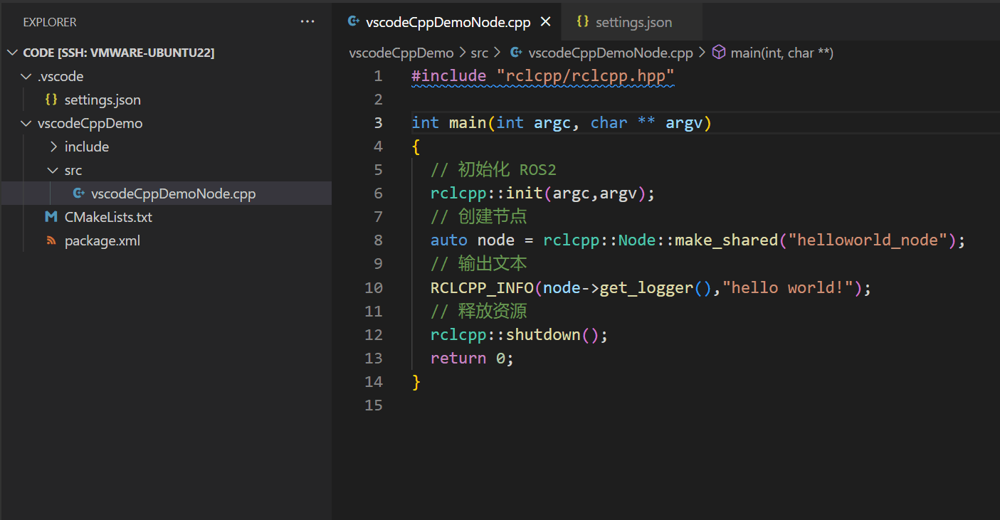

# 1.1 Ubuntu配置与ROS2安装

## 1.1.1 Ubuntu22.04安装

1. 下载Ubuntu22.04：本文选择 [中科大镜像网](https://mirrors.ustc.edu.cn/) ，选择Ubuntu22.04镜像下载，后续放入VMware进行 **断网安装** 



> VMware15链接： 
> 链接：https://pan.baidu.com/s/1BbaGtDhjVXCWeS2vuk3bRw
> 提取码：7lzk 复制这段内容后打开百度网盘手机App，操作更方便哦

2. Ubuntu22.04 换源：将桌面版本的Ubuntu的软件更新设置来源为国内的镜像，或者直接输入命令`sudo gedit /etc/apt/sources.list`将内容改为如下所示：

```shell
deb https://mirrors.ustc.edu.cn/ubuntu/ jammy main restricted universe multiverse
deb-src https://mirrors.ustc.edu.cn/ubuntu/ jammy main restricted universe multiverse
deb https://mirrors.ustc.edu.cn/ubuntu/ jammy-updates main restricted universe multiverse
deb-src https://mirrors.ustc.edu.cn/ubuntu/ jammy-updates main restricted universe multiverse
deb https://mirrors.ustc.edu.cn/ubuntu/ jammy-backports main restricted universe multiverse
deb-src https://mirrors.ustc.edu.cn/ubuntu/ jammy-backports main restricted universe multiverse
deb https://mirrors.ustc.edu.cn/ubuntu/ jammy-security main restricted universe multiverse
deb-src https://mirrors.ustc.edu.cn/ubuntu/ jammy-security main restricted universe multiverse
deb https://mirrors.ustc.edu.cn/ubuntu/ jammy-proposed main restricted universe multiverse
deb-src https://mirrors.ustc.edu.cn/ubuntu/ jammy-proposed main restricted universe multiverse
```




## 1.1.2 下载安装ROS2

1. 输入命令`sudo apt-get update -y`对软件源进行更新，输入`sudo apt-get upgrade -y`对软件进行更新：

```shell
sudo apt-get update -y && sudo apt-get upgrade -y
```

2. 获取ROS2的秘钥，并ROS2的存储库添加到源列表：

```shell
sudo apt install curl gnupg lsb-release && sudo curl -sSL https://raw.githubusercontent.com/ros/rosdistro/master/ros.key -o /usr/share/keyrings/ros-archive-keyring.gpg

echo "deb [arch=$(dpkg --print-architecture) signed-by=/usr/share/keyrings/ros-archive-keyring.gpg] http://packages.ros.org/ros2/ubuntu $(source /etc/os-release && echo $UBUNTU_CODENAME) main" | sudo tee /etc/apt/sources.list.d/ros2.list > /dev/null
```

3. 如果出现关于 `raw.githubusercontent.com` 连接失败的处理

- 1. 访问 `https://tool.lu/ip/` 并输入域名 `raw.githubusercontent.com`，查询 ip 地址，这里查询到的是 `185.199.108.133`



- 2. 修改 `sudo gedit /etc/hosts`文件,并手动添加DNS解析：




4. 下载ROS2-humble：更新软件到最新版本，然后下载ROS2-humble：

```shell
sudo apt-get update -y && sudo apt-get upgrade -y

sudo apt install ros-humble-desktop
```

5. 安装colcon构建工具： 不同于之前ROS1的catkin工具，ROS2用colcon进行包的构建：`sudo apt install python3-colcon-common-extensions`


## 1.1.3 配置ROS2环境并测试

1. 配置ROS2环境： 默认ROS2-humble安装在`/opt/ros/humble/`下，将ROS2的环境添加到用户环境文件`~/.bashrc`中，输入`echo "source /opt/ros/humble/setup.bash" >> ~/.bashrc`

2. 测试ROS2：`ros2 run turtlesim turtlesim_node`和`ros2 run turtlesim turtle_teleop_key`运行小乌龟




# 1.2 使用VSCode搭建ROS2开发环境

## 1.2.1 安装并配置VSCode

1. 安装VSCode: [VSCode下载地址](https://code.visualstudio.com/Download)，持续下一步即可安装完成。

2. 下载完成后安装VSCode插件：插件主要包括 `C/C++` 和 `Python` 以及 `CMake` 的插件，如下图所示：



## 1.2.2 创建ROS2工程的方法

1. ROS2 create命令：通过 `ros2 pkg create --help` 熟悉创建ROS2项目的方法

```shell
pldz@pldz-pc:~/share/ROS2_DEMO/1_Chapter$ ros2 pkg create --help
usage: ros2 pkg create [-h] [--package-format {2,3}] [--description DESCRIPTION] [--license LICENSE]
                       [--destination-directory DESTINATION_DIRECTORY] [--build-type {cmake,ament_cmake,ament_python}]
                       [--dependencies DEPENDENCIES [DEPENDENCIES ...]] [--maintainer-email MAINTAINER_EMAIL]
                       [--maintainer-name MAINTAINER_NAME] [--node-name NODE_NAME] [--library-name LIBRARY_NAME]
                       package_name

Create a new ROS 2 package

positional arguments:
  package_name          The package name

options:
  -h, --help            show this help message and exit
  --package-format {2,3}, --package_format {2,3}
                        The package.xml format.
  --description DESCRIPTION
                        The description given in the package.xml
  --license LICENSE     The license attached to this package; this can be an arbitrary string, but a LICENSE file will only
                        be generated if it is one of the supported licenses (pass '?' to get a list)
  --destination-directory DESTINATION_DIRECTORY
                        Directory where to create the package directory
  --build-type {cmake,ament_cmake,ament_python}
                        The build type to process the package with
  --dependencies DEPENDENCIES [DEPENDENCIES ...]
                        list of dependencies
  --maintainer-email MAINTAINER_EMAIL
                        email address of the maintainer of this package
  --maintainer-name MAINTAINER_NAME
                        name of the maintainer of this package
  --node-name NODE_NAME
                        name of the empty executable
  --library-name LIBRARY_NAME
                        name of the empty library
```

下面对上诉的命令进行简单的介绍：

> - 提示当中的`[]`的内容表示命令关键字，`{}`的内容表示可以携带的参数示例，例如创建 `--build-type` 后面就可以接着 `ament_cmake` 参数
>
> - `[--destination-directory DESTINATION_DIRECTORY]` ：ROS2的项目的位置，即在哪里创建你的ROS2项目
>
> - `[--build-type {cmake,ament_cmake,ament_python}]` ：ROS2编译项目的方式，有`cmake` `ament_camke`和`ament_python`三种可选，`ament_cmake`是基于cmake的一个cmake升级工具， 了解更多的ROS2 ament工具：[(https://blog.csdn.net/gongdiwudu/article/details/126192244)]((https://blog.csdn.net/gongdiwudu/article/details/126192244))
>
> - `[--dependencies]` ：ROS2项目的依赖项，这部分内容后面可以手动增加，其中常见的`rclpy 是 python`的节点依赖项，`rclcpp是C/C++节点的依赖项`
>
> - `[--node-name]` ：预先设置的ROS2节点名字


2. 因此可以使用命令：`ros2 pkg create <你的项目名字> --build-type <选择cmake/ament_camke/ament_python三者之一作为项目的编译工具> --node-name <节点名称，这一项可以不写，后续手动配置> --dependencies <依赖项名字，例如在ROS1中常用的rclpy rclcpp std_msgs sensor_msgs等>`，如：

```shell
ros2 pkg create demo --build-type ament_cmake --node-name demo_node --dependencies rclcpp
```


## 1.2.3 使用VSCode创建ROS2的C/C++项目

1. 创建ROS2 C++工程：`ros2 pkg create vscodeCppDemo --build-type ament_cmake --node-name vscodeCppDemoNode --dependencies rclcpp std_msgs`

2. 查看工程目录结构：`tree . `，可以发现在`src`目录下 **存在了节点名称的cpp文件** ，即ROS2项目已经构建了配置好节点内容的工程

```shell
pldz@pldz-pc:~/share/ROS2_DEMO/1_Chapter/code$ ros2 pkg create vscodeCppDemo --build-type ament_cmake --node-name vscodeCppDemoNode --dependencies rclcpp std_msgs
going to create a new package
package name: vscodeCppDemo
destination directory: /mnt/hgfs/VMware/ROS2_DEMO/1_Chapter/code
package format: 3
version: 0.0.0
description: TODO: Package description
maintainer: ['pldz <pldz@R7000.com>']
licenses: ['TODO: License declaration']
build type: ament_cmake
dependencies: ['rclcpp', 'std_msgs']
node_name: vscodeCppDemoNode
creating folder ./vscodeCppDemo
creating ./vscodeCppDemo/package.xml
creating source and include folder
creating folder ./vscodeCppDemo/src
creating folder ./vscodeCppDemo/include/vscodeCppDemo
creating ./vscodeCppDemo/CMakeLists.txt
creating ./vscodeCppDemo/src/vscodeCppDemoNode.cpp

[WARNING]: Unknown license 'TODO: License declaration'.  This has been set in the package.xml, but no LICENSE file has been created.
It is recommended to use one of the ament license identitifers:
Apache-2.0
BSL-1.0
BSD-2.0
BSD-2-Clause
BSD-3-Clause
GPL-3.0-only
LGPL-3.0-only
MIT
MIT-0

pldz@pldz-pc:~/share/ROS2_DEMO/1_Chapter/code$ tree .
.
└── vscodeCppDemo
    ├── CMakeLists.txt
    ├── include
    │   └── vscodeCppDemo
    ├── package.xml
    └── src
        └── vscodeCppDemoNode.cpp

4 directories, 3 files
```

3. 在`<ROS2工程目录下>/src/<节点cpp>.cpp`进行节点编程，ROS2是C++11的编程风格：

```cpp
#include "rclcpp/rclcpp.hpp"

int main(int argc, char ** argv)
{
  // 初始化 ROS2
  rclcpp::init(argc,argv);
  // 创建节点
  auto node = rclcpp::Node::make_shared("helloworld_node");
  // 输出文本
  RCLCPP_INFO(node->get_logger(),"hello world!");
  // 释放资源
  rclcpp::shutdown();
  return 0;
}
```


4. 针对VSCode的`settings.json`进行配置：在项目下面新建 `.vscode` 文件夹，然后在在该文件夹下新建 `settings.json` , 添加下列内容：

```json
{
    // Settings.json的配置，主要在于添加/opt/ros/humble文件夹下的ros2的include路径
    
    // pldz@pldz-pc:~/share/ROS2_DEMO/1_Chapter/code/.vscode$ tree .
    // .
    // └── settings.json
    // 0 directories, 1 file

    "files.associations": {
        "cstdio": "cpp"
    },
    "C_Cpp.default.includePath": ["/opt/ros/humble/include/**"]
}
```



5. 配置ROS2项目的 `package.xml` 文件：`package.xml` 文件是ROS2项目的功能包管理文件，下面添加了一点注释：

```xml
<?xml version="1.0"?>
<?xml-model href="http://download.ros.org/schema/package_format3.xsd" schematypens="http://www.w3.org/2001/XMLSchema"?>
<package format="3">
  <name>vscodeCppDemo</name>
  <version>0.0.0</version>
  <description>TODO: Package description</description>
  <!-- 包的作者信息,主要来自Git的配置 -->
  <maintainer email="pldz@R7000.com">pldz</maintainer>
  <license>TODO: License declaration</license>

  <!-- 编译工程的工具 -->
  <buildtool_depend>ament_cmake</buildtool_depend>

  <!-- 编译需要的依赖项,可以手动添加 -->
  <depend>rclcpp</depend>
  <depend>std_msgs</depend>

  <test_depend>ament_lint_auto</test_depend>
  <test_depend>ament_lint_common</test_depend>

  <export>
    <build_type>ament_cmake</build_type>
  </export>
</package>
```


6. 配置 `CMakeLists.txt` 文件：`CMakeLists.txt` 是ROS2项目的编译配置文件，下面添加了一点注释：

```cpp
cmake_minimum_required(VERSION 3.8)
project(vscodeCppDemo)

if(CMAKE_COMPILER_IS_GNUCXX OR CMAKE_CXX_COMPILER_ID MATCHES "Clang")
  add_compile_options(-Wall -Wextra -Wpedantic)
endif()

# find dependencies, 这里可以引入外部依赖包
find_package(ament_cmake REQUIRED)
find_package(rclcpp REQUIRED)
find_package(std_msgs REQUIRED)

# 节点(也叫可执行文件)的映射
add_executable(vscodeCppDemoNode src/vscodeCppDemoNode.cpp)

# Include文件的位置
target_include_directories(vscodeCppDemoNode PUBLIC
  $<BUILD_INTERFACE:${CMAKE_CURRENT_SOURCE_DIR}/include>
  $<INSTALL_INTERFACE:include>)

# 目标依赖库
target_compile_features(vscodeCppDemoNode PUBLIC c_std_99 cxx_std_17)  # Require C99 and C++17
ament_target_dependencies(
  vscodeCppDemoNode
  "rclcpp"
  "std_msgs"
)

# 安装规则
install(TARGETS vscodeCppDemoNode
  DESTINATION lib/${PROJECT_NAME})

if(BUILD_TESTING)
  find_package(ament_lint_auto REQUIRED)
  # the following line skips the linter which checks for copyrights
  # comment the line when a copyright and license is added to all source files
  set(ament_cmake_copyright_FOUND TRUE)
  # the following line skips cpplint (only works in a git repo)
  # comment the line when this package is in a git repo and when
  # a copyright and license is added to all source files
  set(ament_cmake_cpplint_FOUND TRUE)
  ament_lint_auto_find_test_dependencies()
endif()

ament_package()

```

7. 利用 `colcon` 工具构建项目：在项目的工程目录下，输入`colcon build`进行构建

```shell
pldz@pldz-pc:~/share/ROS2_DEMO/1_Chapter/code$ colcon build
WARNING: Package name "vscodeCppDemo" does not follow the naming conventions. It should start with a lower case letter and only contain lower case letters, digits, underscores, and dashes.
Starting >>> vscodeCppDemo
--- stderr: vscodeCppDemo                              
WARNING: Package name "vscodeCppDemo" does not follow the naming conventions. It should start with a lower case letter and only contain lower case letters, digits, underscores, and dashes.
---
Finished <<< vscodeCppDemo [8.27s]

Summary: 1 package finished [8.62s]
  1 package had stderr output: vscodeCppDemo
```

8. 执行该项目节点文件：

- 1. 尝试手动执行，在项目目录下的 `build/<ROS2项目名称>` 下存放着项目节点 `ROS2项目节点`，直接运行该文件：如下所示

```shell
pldz@pldz-pc:~/share/ROS2_DEMO/1_Chapter/code$ ./build/vscodeCppDemo/vscodeCppDemoNode 
[INFO] [1682264164.879460585] [helloworld_node]: hello world!
pldz@pldz-pc:~/share/ROS2_DEMO/1_Chapter/code$ file ./build/vscodeCppDemo/vscodeCppDemoNode 
./build/vscodeCppDemo/vscodeCppDemoNode: ELF 64-bit LSB pie executable, x86-64, version 1 (GNU/Linux), dynamically linked, interpreter /lib64/ld-linux-x86-64.so.2, BuildID[sha1]=53b5061fab0864a3b53f587b0cbc8a6be1d342f1, for GNU/Linux 3.2.0, not stripped
```

- 2. 通过ROS2运行节点：首先需要添加项目的install环境，即 `source <项目目录>/install/setup.bash`，然后可以通过`ros2 run <项目名称> <节点名称>` 运行节点

```shell
pldz@pldz-pc:~/share/ROS2_DEMO/1_Chapter/code$ source ./install/setup.bash 
pldz@pldz-pc:~/share/ROS2_DEMO/1_Chapter/code$ ros2 run vscodeCppDemo vscodeCppDemoNode 
[INFO] [1682264459.635230302] [helloworld_node]: hello world!
```


## 1.2.4 使用VSCode创建ROS2的Python项目

# 1.3 ROS2的基本体系


# 1.4 总结和参考内容

## 1.4.1 总结

## 1.4.2 参考内容

- 1. [【ROS2原理3】：构建系统“ament_cmake”和构建工具“ament_tools”](https://blog.csdn.net/gongdiwudu/article/details/126192244)
- 2. [ROS2学习笔记（五）-- ROS2命令行操作常用指令总结（一）](https://blog.csdn.net/aibingjin/article/details/123899829)