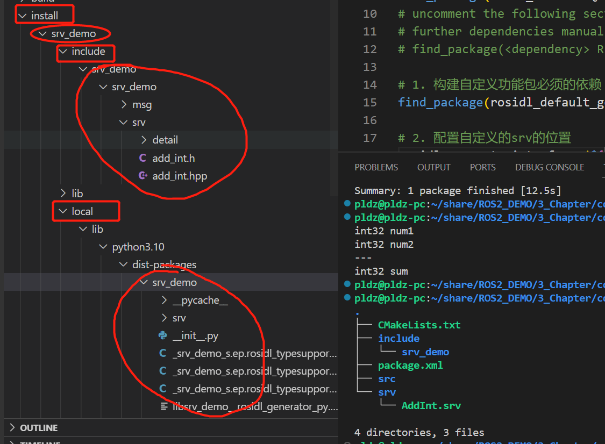
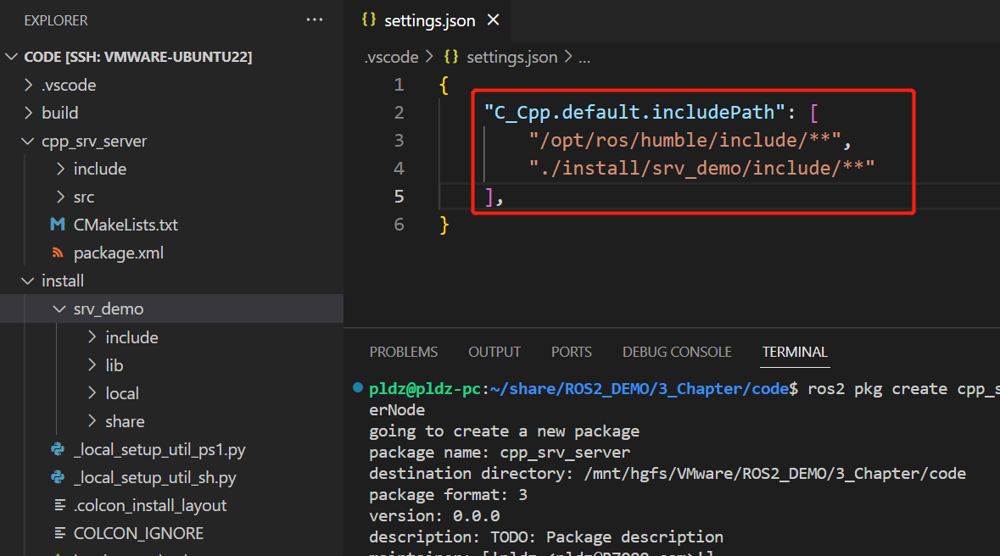
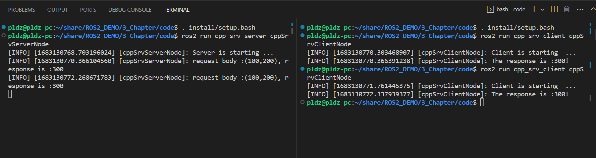

# 3 ROS2服务通讯基础

## 3.1 服务通讯介绍

> 参考内容
>
> [Understanding services](https://docs.ros.org/en/humble/Tutorials/Beginner-CLI-Tools/Understanding-ROS2-Services/Understanding-ROS2-Services.html)

服务通讯是ROS2的一种基于请求响应式的通讯方式，与之前的话题通讯不同的是服务通讯不是连续的数据流式的通讯，而是需要特定的触发才能收到回复的模式。

服务通讯可以是单个服务端和和单个客户端直接的通讯，一对一的模式


服务通讯也可以是单个服务端和多个客户端通讯，一对多的模式


## 3.2 ROS2服务通讯的基本流程

事实上，服务通讯和自定义的话题通讯的操作过程很类似，即将所需要利用到服务模块利用`ament_camke`工具编译成`.c`和`.py`的ROS2功能包，然后新建的功能包依赖这个服务功能包完成通讯。

### 3.2.1 创建ROS2服务通讯功能包的基本流程

- 1. 创建ROS2功能包，功能包可以只用来作为存放自定义的`msg/srv/action`，不需要节点node的功能包，**且`--build-type`必须是`ament_camke`** ，因为目前来看，Python的自定义的消息或者服务也需要通过cmake编译出来再调用，**功能包必须是下划线的推荐命名方法，而不是大小写的驼峰，否则会报错**，如下所示：


```shell
  rosidl_adapter.parser.InvalidResourceName: 'xxxxx' is an invalid
  package name.  It should have the pattern
  '^(?!.*__)(?!.*_$)[a-z][a-z0-9_]*$'
```

- 2. 在ROS2功能包内创建`srv`文件夹，里面存放自定义的`.srv`消息文件，并且 **`.srv`文件必须是大写开头的符合类的命名规则**

- 3. 配置`packages.xml`文件，都需要配置下面的内容(下面的配置项与`.srv`文件无关，是默认的固定配置)

```xml
<!-- 这一项是针对在srv文件中可能用到的其他依赖项，例如geomtry_msgs等等，如过没有用到就不添加 -->
<depend>其他的depend</depend>

<!-- 下面三项是必须的 -->
<build_depend>rosidl_default_generators</build_depend>
<exec_depend>rosidl_default_runtime</exec_depend>
<member_of_group>rosidl_interface_packages</member_of_group>
```

- 4. 配置`CMakeLists.txt`文件,`find_package`和`rosidl_generate_interfaces`

```cmake
# 0. 是针对在srv文件中可能用到的其他依赖项，例如geomtry_msgs等等，则需要添加
# find_package(geometry_msgs REQUIRED)

# 1. rosidl_default_generators是必须添加的内容
find_package(rosidl_default_generators REQUIRED)

# 2. rosidl_generate_interfaces必须配置，里面添加srv文件位置
rosidl_generate_interfaces(${PROJECT_NAME}
# 2.1 添加自定义的srv位置，例如存放在功能包的srv文件夹下的xxx.srv
  "srv/xxx.srv"
# 2.2 可选，如果xxx.srv依赖了其他的内容,例如依赖了geometry_msgs
  DEPENDENCIES geometry_msgs
)
```

- 5. 编译功能包:`colcon build --packages-select <功能包名>`

- 6. 此时激活`install`目录下的`setup.bash`如`. install/setup.bash`，可以通过`ros2 interface show <功能包名称>/srv/xxx.srv`查看到`xxx.srv`内容，此时编译好的`srv`的`.c`文件存放在`install/<功能包名>/include`下，`.py`文件则存放在`install/<功能包名>/local/`

### 3.2.2 创建ROS2服务通讯功能包示例

1. 创建自定义消息功能包`srv_demo`，采用`ament_cmake`方式：`ros2 pkg create srv_demo --build-type ament_cmake`

2. 在功能包内创建`srv`文件夹，其中存放`AddInt.srv`文件，**需要利用到`---`符号作为分割，文件在`---`上面的内容作为请求体的参数，在`---`下面的内容作为响应体的参数**，文件内容如下：

```cpp
int32 num1
int32 num2
---
int32 sum
```

3. 此时的功能包内部的目录结构如下：`tree -a`

```shell
pldz@pldz-pc:~/share/ROS2_DEMO/3_Chapter/code/srv_demo$ tree -a
.
├── CMakeLists.txt
├── include
│   └── srv_demo
├── package.xml
├── src
└── srv
    └── AddInt.srv
```

1. 配置`packages.xml`添加依赖项，由于`AddInt.srv`没有依赖任何的东西因此不需要添加其他的`depend`:

```xml
<?xml version="1.0"?>
<?xml-model href="http://download.ros.org/schema/package_format3.xsd" schematypens="http://www.w3.org/2001/XMLSchema"?>
<package format="3">
  <name>msg_demo</name>
  <version>0.0.0</version>
  <description>TODO: Package description</description>
  <maintainer email="pldz@R7000.com">pldz</maintainer>
  <license>TODO: License declaration</license>

  <buildtool_depend>ament_cmake</buildtool_depend>

  <!-- 构建自定义功能包的的必须依赖项 -->
  <buildtool_depend>rosidl_default_generators</buildtool_depend>
  <exec_depend>rosidl_default_runtime</exec_depend>
  <member_of_group>rosidl_interface_packages</member_of_group>

  <test_depend>ament_lint_auto</test_depend>
  <test_depend>ament_lint_common</test_depend>

  <export>
    <build_type>ament_cmake</build_type>
  </export>
</package>

```

5. 配置`CMakeLists.txt`文件，添加构建自定义`AddInt.srv`的依赖：

```cmake
cmake_minimum_required(VERSION 3.8)
project(srv_demo)

if(CMAKE_COMPILER_IS_GNUCXX OR CMAKE_CXX_COMPILER_ID MATCHES "Clang")
  add_compile_options(-Wall -Wextra -Wpedantic)
endif()

# find dependencies
find_package(ament_cmake REQUIRED)
# uncomment the following section in order to fill in
# further dependencies manually.
# find_package(<dependency> REQUIRED)

# 1. 构建自定义功能包必须的依赖
find_package(rosidl_default_generators REQUIRED)

# 2. 配置自定义的srv的位置
rosidl_generate_interfaces(${PROJECT_NAME}
  "srv/AddInt.srv"
)

if(BUILD_TESTING)
  find_package(ament_lint_auto REQUIRED)
  # the following line skips the linter which checks for copyrights
  # comment the line when a copyright and license is added to all source files
  set(ament_cmake_copyright_FOUND TRUE)
  # the following line skips cpplint (only works in a git repo)
  # comment the line when this package is in a git repo and when
  # a copyright and license is added to all source files
  set(ament_cmake_cpplint_FOUND TRUE)
  ament_lint_auto_find_test_dependencies()
endif()

ament_package()


```

6. 构建功能包：`colcon build --packages-select srv_demo`

7. 查看自定义的消息：激活环境：`. install/setup.bash `，查看自定义消息`ros2 interface show srv_demo/srv/AddInt`

```shell
pldz@pldz-pc:~/share/ROS2_DEMO/3_Chapter/code$ colcon build --packages-select srv_demo
Starting >>> srv_demo
Finished <<< srv_demo [12.2s]                     

Summary: 1 package finished [12.5s]
pldz@pldz-pc:~/share/ROS2_DEMO/3_Chapter/code$ . install/setup.bash 
pldz@pldz-pc:~/share/ROS2_DEMO/3_Chapter/code$ ros2 interface show srv_demo/srv/AddInt 
int32 num1
int32 num2
---
int32 sum
```

8. 查看`instll`下面的文件：其中`.c`的class文件在`install/<功能包名>/include/<功能包名>/<功能包名>/msg/**`，`.py`在`install/<功能包名>/local/lib/python3.10/dist-packages/<功能包名>/msg/**`，后续Vscode可以通过配置`settings.json`添加提示



## 3.3 使用C/C++实现ROS2服务通讯

这里直接使用3.2.2创建的srv_demo服务功能包进行ROS2 C/C++的服务通讯的实现

> 参考内容：
>
> [Writing a simple service and client (C++)](https://docs.ros.org/en/humble/Tutorials/Beginner-Client-Libraries/Writing-A-Simple-Cpp-Service-And-Client.html)
>
> [2.3.3_服务通信_C++实现_01框架搭建](https://www.bilibili.com/video/BV1Td4y1z7oi)
>
> [ROS2探索（三）service](https://blog.csdn.net/qq_16893195/article/details/113571858)


### 3.3.1 创建C/C++服务通讯服务端功能包并编写节点文件

1. 创建功能包，其中功能包名称为`cpp_srv_server`，节点名为`cppSrvServerNode`：`ros2 pkg create cpp_srv_server --build-type ament_cmake --node-name cppSrvServerNode`

2. 配置Vscode环境，在工作空间创建`.vscode`文件夹，并加入`settings.json`文件，添加`ROS2`的`include`环境和当前工作空间的`install`文件夹下的`srv_demo`功能包的`include`路径：

```json
{
    "C_Cpp.default.includePath": [
        "/opt/ros/humble/include/**",
        "./install/srv_demo/include/**"
    ],
}
```



3. 编写服务端节点文件，主要包括导入包，创建服务节点，实现回调函数：

```cpp
// 1. 调用自定义的服务文件
// 1.1 rclcpp和srv_demo两个功能包的头文件
// 如果有vscode的下划线提示，说明是settings.json没有配置好
#include "rclcpp/rclcpp.hpp"
#include "srv_demo/srv/add_int.hpp"

// 1.2. 调用功能包下的自定义的服务，其中自定义的服务名已经变成了一个类名
using srv_demo::srv::AddInt;

// std_bind的占位符
using std::placeholders::_1;
using std::placeholders::_2;

// 2.定义节点类；
class CppSrvServer: public rclcpp::Node{
  public:
  // 2.1 构造函数，其中节点名直接赋予cppSrvServerNode
    CppSrvServer():Node("cppSrvServerNode"){
      // 2.2 创建服务端
      server_ = this->create_service<AddInt>("mySrvName",std::bind(&CppSrvServer::addIntFunc, this, _1, _2));
      RCLCPP_INFO(this->get_logger(),"Server is starting ...");
    }
  private:
    
    // 3. 服务端的回调函数实现，其中参数的写法区分主要在于类型，参数数量包括请求体req和响应体rsp
    void addIntFunc(const AddInt::Request::SharedPtr req, const AddInt::Response::SharedPtr rsp)
    {
      rsp->sum = req->num1 + req->num2;
      RCLCPP_INFO(this->get_logger(),"request body :(%d,%d), response is :%d", req->num1, req->num2, rsp->sum);
    }

    // 4 服务的声明
    rclcpp::Service<AddInt>::SharedPtr server_;
};

int main(int argc, char const *argv[])
{
  rclcpp::init(argc,argv);
  auto server_ = std::make_shared<CppSrvServer>();
  rclcpp::spin(server_);
  rclcpp::shutdown();
  return 0;
}

```

### 3.3.2 配置C/C++服务通讯服务端功能包

4. 配置`packages.xml`文件，添加依赖项有`rclcpp`用于构建节点，和`srv_demo`用于构建`AddInt`：

```xml
<?xml version="1.0"?>
<?xml-model href="http://download.ros.org/schema/package_format3.xsd" schematypens="http://www.w3.org/2001/XMLSchema"?>
<package format="3">
  <name>cpp_srv_server</name>
  <version>0.0.0</version>
  <description>TODO: Package description</description>
  <maintainer email="pldz@R7000.com">pldz</maintainer>
  <license>TODO: License declaration</license>

  <buildtool_depend>ament_cmake</buildtool_depend>

  <test_depend>ament_lint_auto</test_depend>
  <test_depend>ament_lint_common</test_depend>

  <!-- 依赖rclcpp创建节点和自定义的服务功能包 -->
  <depend>rclcpp</depend>
  <depend>srv_demo</depend>

  <export>
    <build_type>ament_cmake</build_type>
  </export>
</package>

```

5. 配置`CMakeLists.txt`：

```cmake
cmake_minimum_required(VERSION 3.8)
project(cpp_srv_server)

if(CMAKE_COMPILER_IS_GNUCXX OR CMAKE_CXX_COMPILER_ID MATCHES "Clang")
  add_compile_options(-Wall -Wextra -Wpedantic)
endif()

# find dependencies
find_package(ament_cmake REQUIRED)
# uncomment the following section in order to fill in
# further dependencies manually.
# find_package(<dependency> REQUIRED)

# 1. 列出依赖项的包
find_package(rclcpp REQUIRED)
find_package(srv_demo REQUIRED)

# 2. 默认是已经创建了构建节点的文件配置
add_executable(cppSrvServerNode src/cppSrvServerNode.cpp)

# 3. 默认已经包括<INSTALL_INTERFACE>的路径也不用更改
target_include_directories(cppSrvServerNode PUBLIC
  $<BUILD_INTERFACE:${CMAKE_CURRENT_SOURCE_DIR}/include>
  $<INSTALL_INTERFACE:include>)
target_compile_features(cppSrvServerNode PUBLIC c_std_99 cxx_std_17)  # Require C99 and C++17

# 4. ament工具构建节点的依赖配置
ament_target_dependencies(
  cppSrvServerNode
  rclcpp
  srv_demo
)

# 5. Install配置，默认ros2 run <包名>的配置
install(TARGETS cppSrvServerNode
  DESTINATION lib/${PROJECT_NAME})

if(BUILD_TESTING)
  find_package(ament_lint_auto REQUIRED)
  # the following line skips the linter which checks for copyrights
  # comment the line when a copyright and license is added to all source files
  set(ament_cmake_copyright_FOUND TRUE)
  # the following line skips cpplint (only works in a git repo)
  # comment the line when this package is in a git repo and when
  # a copyright and license is added to all source files
  set(ament_cmake_cpplint_FOUND TRUE)
  ament_lint_auto_find_test_dependencies()
endif()

# 6. 生成包的环境
ament_package()

```

### 3.3.3 编译并运行C/C++服务通讯服务端

6. 编译： `colcon build --packages-select cpp_srv_server`

7. 激活环境：`. install/setup.bash`

8. 运行：`ros2 run cpp_srv_server cppSrvServerNode`


```shell
pldz@pldz-pc:~/share/ROS2_DEMO/3_Chapter/code$ colcon build --packages-select cpp_srv_server
Starting >>> cpp_srv_server
Finished <<< cpp_srv_server [20.6s]                       
                      
Summary: 1 package finished [21.0s]
pldz@pldz-pc:~/share/ROS2_DEMO/3_Chapter/code$ . install/setup.bash 
pldz@pldz-pc:~/share/ROS2_DEMO/3_Chapter/code$ ros2 run cpp_srv_server cppSrvServerNode 
[INFO] [1683125184.734934447] [cppSrvServerNode]: Server is starting ...
^C[INFO] [1683125186.240946812] [rclcpp]: signal_handler(signum=2)
```

### 3.3.4 创建C/C++服务通讯客户端功能包并编写节点文件

1. 创建功能包，功能包名为`cpp_srv_client`，节点名称为`cppSrvClientNode`，依赖`rclcpp`和`srv_demo`：`ros2 pkg create cpp_srv_client --build-type ament_cmake --node-name cppSrvClientNode --dependencies rclcpp srv_demo`

2. 编写客户端节点，注意在此过程中需要和 **服务端的连接进行判断，以及发送的请求是否能够收到返回值的用法的操作**：

```cpp
// 1. 调用自定义的服务文件
// 1.1 rclcpp和srv_demo两个功能包的头文件
#include "rclcpp/rclcpp.hpp"
#include "srv_demo/srv/add_int.hpp"

// 1.2. 调用功能包下的自定义的服务，其中自定义的服务名已经变成了一个类名
using srv_demo::srv::AddInt;

// 时间函数用于持续访问服务端
using namespace std::chrono_literals;

// 2.定义节点类；
class CppSrvClient: public rclcpp::Node{
  public:
    CppSrvClient():Node("cppSrvClientNode")
    {
      // 2.1 创建客户端,并绑定服务通讯名称为mySrvName
      client_ = this->create_client<AddInt>("mySrvName");
      RCLCPP_INFO(this->get_logger(),"Client is starting  ...");
    }
    // 2.2 等待与服务的连接
    bool connect_server(){
      while (!client_->wait_for_service(1s))
      {
        if (!rclcpp::ok())
        {
          RCLCPP_INFO(rclcpp::get_logger("rclcpp"),"Interrupted while waiting for the service. Exiting.");
          return false;
        }

        RCLCPP_INFO(this->get_logger(),"service not available, waiting again...");
      }
      return true;
    }
    // 2.3 客户端发送请求；
    rclcpp::Client<srv_demo::srv::AddInt>::FutureAndRequestId send_request(int32_t num1, int32_t num2)
    {
      auto request = std::make_shared<AddInt::Request>();
      request->num1 = num1;
      request->num2 = num2;
      // 2.3.1 发送请求
      auto response = client_->async_send_request(request);
      return response;
    }

  private:
    // 2.4 服务通讯客户端的声明
    rclcpp::Client<AddInt>::SharedPtr client_;
};


int main(int argc, char ** argv)
{
  // 3. 初始化ROS2客户端
  rclcpp::init(argc,argv);

  // 3.1 创建对象指针并调用其功能；
  auto cppSrvClientNode = std::make_shared<CppSrvClient>();
  // 3.2 连接客户端
  bool flag = cppSrvClientNode->connect_server();
  if (!flag)
  {
    RCLCPP_INFO(rclcpp::get_logger("rclcpp"),"Connect failed! ");
    return 0;
  }

  // 3.3 发送请求并等待响应
  auto response = cppSrvClientNode->send_request(100,200);

   // 3.4 节点处理响应
  if (rclcpp::spin_until_future_complete(cppSrvClientNode,response) == rclcpp::FutureReturnCode::SUCCESS)
  {
    RCLCPP_INFO(cppSrvClientNode->get_logger(),"The response is :%d!", response.get()->sum);

  } else {
    RCLCPP_INFO(cppSrvClientNode->get_logger(),"Request error");
  }
  rclcpp::shutdown();
  return 0;
}
```

### 3.3.5 编译并运行C/C++服务通讯客户端节点

4. 由于在创建包的过程中已经指明了所有依赖项，不需要进行额外的配置，直接编译运行即可：``colcon build --packages-select cpp_srv_client``

5. 激活环境并运行节点


